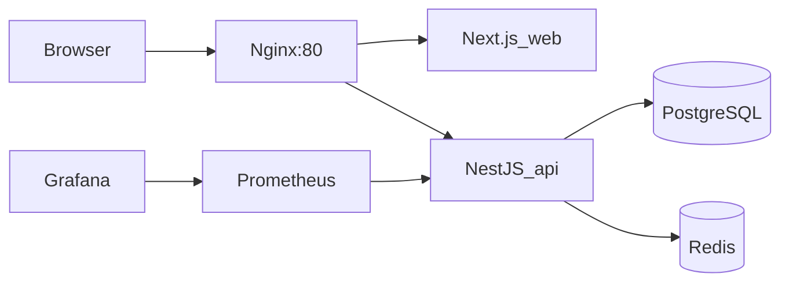

# Employee Safety & Response

企業緊急事件安全回報系統：讓員工在事件期間快速回報安全狀態，主管掌握轄下回報進度，管理員建立事件、維護使用者並檢視全公司報表。專案採 **Monorepo**（pnpm workspaces）、**Next.js 14** 前端、**NestJS** REST API、**PostgreSQL + Prisma**、**Docker Compose** 編排（含 **Redis**、**Nginx**、**Prometheus**、**Grafana**），展示雲原生常見的可觀測性、健康檢查與多容器部署。

## 架構總覽



- **入口**：瀏覽器只打 `http://localhost`（Nginx），`/api/*` 轉發至 API，`/` 轉發至前端。
- **監控**：Prometheus 抓取 `http://api:3000/metrics`（不需 JWT）；Grafana 預設資料源指向 Prometheus（`http://localhost:3002`，帳密 `admin` / `admin`）。

## 角色與 User Story 對照（摘要）

| 角色 | 代表需求 |
|------|-----------|
| **EMPLOYEE** | 查看進行中事件、提交/更新自己的安全回報、查看自己的回報與個人統計、讀取通知 |
| **MANAGER** | 查看事件、轄下/部門回報列表、部門範圍統計、接收未回報提醒通知 |
| **ADMIN** | 建立/更新事件、全公司回報與統計、使用者與部門維護、手動觸發未回報提醒、稽核紀錄唯讀 |

## 雲原生與資料層：本機 vs 雲端

應用程式**跑在你電腦或 VM／K8s 上**，與**資料庫放在哪裡**是分開的。預設文件寫「本機 Postgres」是為了 **開發與期末 demo 不必先辦帳號**；**雲原生課程交件或報告**很適合改成 **雲端託管 PostgreSQL**，做法只有一步：**把 `DATABASE_URL` 換成雲端主機給你的 `postgresql://…` 連線字串**，其餘（Prisma migrate、Nest API、Docker 裡的 api 容器）都不必改程式。

常見選擇（皆有免費或試用額度，請自行查官網最新方案）：

| 服務 | 說明 |
|------|------|
| [Neon](https://neon.tech) | Serverless Postgres，連線字串常需加 `?sslmode=require` |
| [Supabase](https://supabase.com) | Postgres + 儀表，專案設定裡複製 Database URL |
| [Railway](https://railway.app) / [Render](https://render.com) | 一鍵 Postgres，適合小專題 |
| AWS RDS / GCP Cloud SQL / Azure Database for PostgreSQL | 典型企業雲，報告可寫 SLA、備份、多 AZ |

**Redis** 同理：本機或 Compose 的 `redis` 可換成 [Upstash](https://upstash.com) 等雲端 Redis，只要把 `REDIS_URL` 改成雲端提供的 URL；未設定時專案仍會跑，只是提醒 idempotency 等進階行為會略過。

**Docker Compose**：`postgres` / `redis` 服務代表的是「可替換的依賴」；上雲部署時常改為 **只跑 app + nginx（或交給託管平台）**，資料庫與快取改連 **受管服務**——這正是雲原生裡常見的「狀態外置、無狀態應用水平擴展」敘事。

## 本機開發

**前置**：Node 20+、pnpm，以及下列**擇一**：

- **本機／容器**：Docker Compose 內建 Postgres，或本機安裝的 PostgreSQL。  
- **雲端 Postgres**：在 `apps/api/.env` 設定 `DATABASE_URL` 與 **`DIRECT_URL`**（見 `apps/api/.env.example`）。Supabase 若直連 `db.*.supabase.co:5432` 出現 **P1001**，多為網路/IPv4 限制，請改 Dashboard **Connect** 裡的 **Session pooler**（`*.pooler.supabase.com:5432`），兩個變數可先填同一條 URI。

1. 複製環境變數並依需求修改：

   ```bash
   cp .env.example .env
   cp apps/api/.env.example apps/api/.env   # API 專用；migrate 需 postgresql:// 不可 prisma+postgres://
   cp apps/web/.env.example apps/web/.env.local   # Next 會讀 apps/web/.env.local，讓登入打到 Nest 而非 Next 自己
   ```

2. 安裝依賴：

   ```bash
   pnpm install
   ```

3. 資料庫遷移與種子（在 `apps/api` 目錄下，需有效 `DATABASE_URL`）：

   ```bash
   cd apps/api
   pnpm exec prisma migrate deploy
   pnpm exec prisma db seed
   ```

4. 啟動 API 與 Web：

   ```bash
   # 專案根目錄：一次開 API + 前端（推薦）
   pnpm dev
   ```

   或分兩個終端機：在**根目錄**執行 `pnpm dev:api` 與 `pnpm dev:web`。  
   若你人在 **`apps/api` 目錄**，沒有 `dev:api` 這個指令，請用 **`pnpm dev`** 或 **`pnpm start:dev`**（同一件事）。

   **注意**：Nest 啟動時會先印出「Mapped route」日誌；**若尚未開 Postgres**，先前版本會在這之後因 Prisma 連線失敗而整支程式結束（其實沒有在 listen）。目前改為 **延遲連線**，API 會先成功 `listen`，`GET /health` 可通；**登入、事件等需 DB 的 API** 仍要在 Postgres 起來並跑過 migrate/seed 後才會正常。

5. 瀏覽器：**前端** `http://localhost:3001`（`pnpm dev:web` 固定使用 3001，避免與 API 搶埠），**API** `http://localhost:3000`。請在 `apps/web/.env.local`（或環境變數）設定 `NEXT_PUBLIC_API_URL=http://localhost:3000/api/v1`，否則登入請求會誤打到 Next 本身而出現 **404**。登入種子帳號（密碼皆為 `Password123!`）：

   - `admin@demo.com` — ADMIN  
   - `manager@demo.com` — MANAGER  
   - `employee1@demo.com` / `employee2@demo.com` / `employee3@demo.com` — EMPLOYEE  

## Docker Compose（完整堆疊）

```bash
docker compose up --build
```

- 應用入口：**http://localhost**（Nginx）  
- 前端建置參數 `NEXT_PUBLIC_API_URL` 預設為 `http://localhost/api/v1`（瀏覽器經由同一網域呼叫 API）。  
- Prometheus：**http://localhost:9090**  
- Grafana：**http://localhost:3002**（admin / admin）  
- Postgres / Redis 埠對外映射見 `docker-compose.yml`。

API 容器啟動時會執行 `prisma migrate deploy` 再啟動 `node dist/src/main.js`。

## 測試

```bash
# 單元測試（API）
pnpm --filter api test

# E2E：啟動完整 AppModule，但 Prisma/Redis 以 test double 取代，**不需本機 Postgres 即可跑**（驗證 /health、/health/ready）
pnpm --filter api test:e2e
```

## 負載測試（k6）

需本機安裝 [k6](https://k6.io/)。對 Nginx 健康檢查做輕量壓測：

```bash
BASE_URL=http://localhost k6 run infra/k6/health.js
```

## 專案結構（精簡）

```
final-project/
├── apps/
│   ├── api/                 # NestJS + Prisma
│   └── web/                 # Next.js 14 + shadcn/ui + TanStack Query
├── infra/
│   ├── nginx/               # 反向代理設定
│   ├── prometheus/
│   │   ├── prometheus.yml   # scrape 設定（15s interval）
│   │   └── rules/
│   │       └── api-alerts.yml  # HighErrorRate / HighLatency / PodDown
│   ├── grafana/provisioning/
│   │   ├── datasources/     # Prometheus 資料源（uid: prometheus）
│   │   └── dashboards/      # API Overview dashboard（自動載入）
│   ├── k8s/                 # kind / minikube 用 manifest
│   │   └── hpa.yaml         # HPA（minReplicas:2, maxReplicas:10）
│   │   └── gcp/             # GKE 用 manifest（LoadBalancer service）
│   └── k6/                  # 健康檢查負載測試
├── docker-compose.yml
├── pnpm-workspace.yaml
├── .env.example
└── README.md
```

## Kubernetes

本 repo 的 **Docker Compose** 可視為「單節點上的多容器預演」；`infra/k8s/` 已包含 HPA 等 manifest，遷到 **K8s** 時通常這樣對應：

| Compose 概念 | Kubernetes 常見做法 |
|----------------|----------------------|
| `api` 服務 | `Deployment`（多副本）+ `Service`（ClusterIP）；水平擴展用 **HPA**（CPU / RPS） |
| `web` 服務 | 同上；`NEXT_PUBLIC_*` 在 **build 時** 決定，CI 裡用 `docker build --build-arg` 或改為 **runtime 設定**（例如只打同源 `/api`） |
| `nginx` | 多數用 **`Ingress`**（如 ingress-nginx、Gateway API）取代叢集內自建 Nginx Pod；或保留 **Ingress Controller + 單一 Nginx** |
| `postgres` | 課程／生產建議 **叢集外受管 DB**（RDS、Cloud SQL、Neon）；在 K8s 內用 **`Secret` 存 `DATABASE_URL`**，不要用無持久化保障的單 Pod Postgres |
| `redis` | **ElastiCache / Memorystore / Upstash**，或叢集內 **Helm bitnami/redis**（StatefulSet）；連線字串放 `Secret` |
| `prometheus` / `grafana` | 可用 **kube-prometheus-stack** 等 Helm；或交給託管監控（Datadog、GCP Monitoring） |

**健康檢查（已內建）**：在 Pod 的 `livenessProbe` 設 `GET /health`，`readinessProbe` 設 `GET /health/ready`（會查 Postgres；若 DB 尚未就緒可調整延遲或暫時只對 API 就緒）。

**Prisma migrate**：常見做法是 **`Job` 執行一次** `prisma migrate deploy`（或 CI/CD pipeline 在部署前跑），再滾動更新 `Deployment`，避免每個 Pod 同時 migrate。

**機密**：`JWT_SECRET`、`DATABASE_URL`、`REDIS_URL` 一律走 **`Secret`**（必要時搭配 External Secrets / 雲端 Secret Manager），不要進 image。

`infra/k8s/hpa.yaml`（及 `gcp/hpa.yaml`）已實作 `autoscaling/v2` HPA，CPU 60% / 記憶體 70% 觸發擴縮，最少 2 個 replica 確保滾動更新期間不中斷。套用方式：

```bash
kubectl apply -f infra/k8s/namespace.yaml
kubectl apply -f infra/k8s/hpa.yaml
kubectl get hpa -n safety-demo
```

## 進階與限制（報告可撰寫方向）

- **i18n**：後端錯誤訊息與通知內文可改為 template key；前端可接 `next-intl`。  
- **高流量**：API 已接 Redis，可擴充 rate limit、快取熱門 `stats`、非同步通知佇列。  
- **可靠性 / SPOF**：Compose 為單節點展示；生產環境可改 **多 API 副本 + Nginx upstream**、**DB 主從**、**Redis Sentinel**、**K8s readiness/liveness**（對應本專案 `/health`、`/health/ready`）。  
- **認證**：示範使用 `localStorage` 存 JWT；生產建議 **HttpOnly Cookie** 或 **BFF**。

## 授權

本專案為課程期末專案示範用程式碼。
